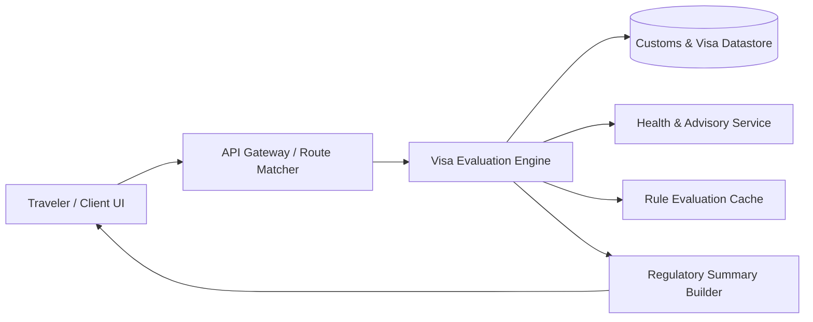

# Visa & Travel Requirements Checker

A full-stack travel intelligence platform that validates international visa regimes, passport validity rules, customs controls, and entry protocols for cross-border transit across 190+ jurisdictions.

## System overview



## Key capabilities

- Cross-border eligibility evaluation (Visa-Free, VoA, eVisa, Embassy Visa).
- Dynamic passport validity checks (6-month vs. 3-month rules and required blank page count).
- International health and immunization mandates tracking (Yellow Fever, endemic vector zones).
- Customs, currency threshold declaration ($10,000 USD baseline), and contraband restrictions.
- Deterministic response payloads formatted for edge caching and client rendering.

## Technology stack

| Area | Technologies present in the repository |
| :--- | :--- |
| **Frontend** | React 18, Vite, Tailwind CSS, Lucide Icons |
| **Backend & Routing** | Node.js 20.x, Express.js 4.x REST APIs |
| **Data & Storage** | Structured schema catalog, In-Memory Lookup Engine |
| **Tooling & Ops** | Docker Compose, GitHub Actions CI/CD, Vite Base Config |

## Local development

```bash
# Frontend
cd client
npm install
npm run dev

# Backend Service
cd ../server
npm install
npm run dev
```

## API surface

| Group | Method | Endpoint | Description |
| :--- | :--- | :--- | :--- |
| **Regulations** | `GET` | `/api/v1/requirements?from={origin}&to={dest}` | Retrieve full bilateral entry rule profile |
| **Countries** | `GET` | `/api/v1/countries` | Fetch catalog of sovereign states and ISO codes |
| **Customs** | `GET` | `/api/v1/customs/{countryCode}` | Retrieve currency thresholds & baggage duty rules |
| **Health** | `GET` | `/api/v1/health-advisories/{countryCode}` | Immunization and quarantine protocols |
| **Ops** | `GET` | `/health` | Service uptime and engine telemetry |

## Engineering notes and current limits

- Regulatory datasets represent static synthetic baselines; production deployments require authenticated embassy feed ingestion.
- Cross-border calculations assume regular passport holders; diplomatic and official passports follow distinct protocol sets.

## Documentation

- [Architecture & Boundaries](docs/ARCHITECTURE.md)
- [Data Flow Specification](docs/DATA_FLOW.md)
- [System Design](docs/SYSTEM_DESIGN.md)
- [Technical Interview Guide](docs/INTERVIEW_GUIDE.md)

## License and author

Released under the [MIT License](LICENSE). Maintained by [Harivikash Katta](https://github.com/Harry-aura).
