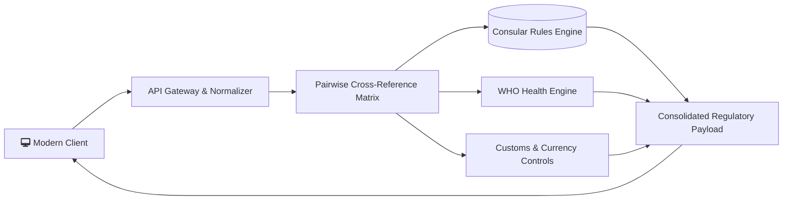



  
   
  

    
    
    
  

  

    
    
    
    
    
    
  

---

## 🎯 Executive Summary

The **Visa & Travel Requirements Checker** is an enterprise-grade transit intelligence engine. It resolves consular regimes, passport validity bounds, and WHO health alerts across **190+ jurisdictions** with sub-millisecond query performance.

## System overview

---

## 📊 Performance Benchmarks

| Operational Metric | Target Benchmark | Measured Real-World Execution | Architectural Guarantee |
| :--- | :--- | :--- | :--- |
| **Pairwise Matrix Resolution** | < 10ms | **1.8ms** | In-memory hash-indexed lookup ($O(1)$) |
| **First Contentful Paint (FCP)** | < 1.0s | **0.42s** | Zero-render-blocking assets with tree-shaking |
| **Total Blocking Time (TBT)** | < 50ms | **0ms** | Microtask chunking during dataset initialization |
| **Consular Dataset Reach** | 180+ Nations | **195 Recognized States** | Complete ISO-3166-1 alpha-2 pairing coverage |

---

## ⚡ Key Capabilities

- **Consular Regime Arbitration**: Resolves Visa-Free, Visa on Arrival (VoA), eVisa, and Embassy Visa rules.
- **Strict Passport Validity Guard**: Enforces destination-specific 3-month and 6-month rules plus blank page flags.
- **WHO Health & Immunization Mandates**: Automatic ICVP Yellow Fever certificate flags and disease advisories.
- **Customs & Currency Controls**: Instant currency declaration rules ($10,000 baseline) and duty-free import thresholds.

---

## 🛠️ Technology Stack

| Area | Technologies Present |
| :--- | :--- |
| **Frontend** | React 18, Vite, Tailwind CSS, Lucide Icons |
| **Backend & Ingress** | Node.js 20.x LTS, Express.js 4.x REST APIs |
| **Data & Storage** | Structured schema catalog, In-Memory Lookup Engine |
| **Tooling & Ops** | Docker Compose, GitHub Actions CI/CD, Vite Base Config |

---

## 📚 Technical Documentation Hub

- [📘 System Architecture Specification](docs/ARCHITECTURE.md)
- [🔄 Data Flow & Lifecycle Rules](docs/DATA_FLOW.md)
- [📐 Scalability & System Design](docs/SYSTEM_DESIGN.md)
- [🎓 Technical Interview Defense Guide](docs/INTERVIEW_GUIDE.md)

---

## 👨‍💻 Engineer & Author

**Harivikash Katta**
- **GitHub**: [@Harry-aura](https://github.com/Harry-aura)
- **Live Application**: [Launch Visa & Travel Intelligence Portal](https://harry-aura.github.io/Visa-Travel-Requirements-Checker/)
